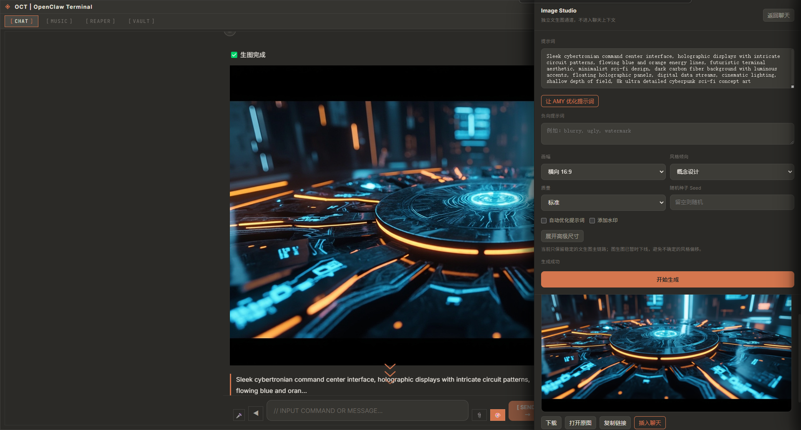
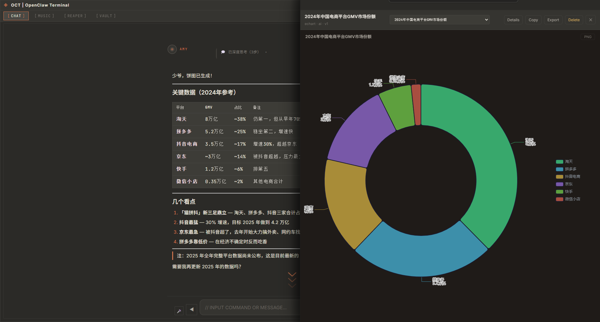
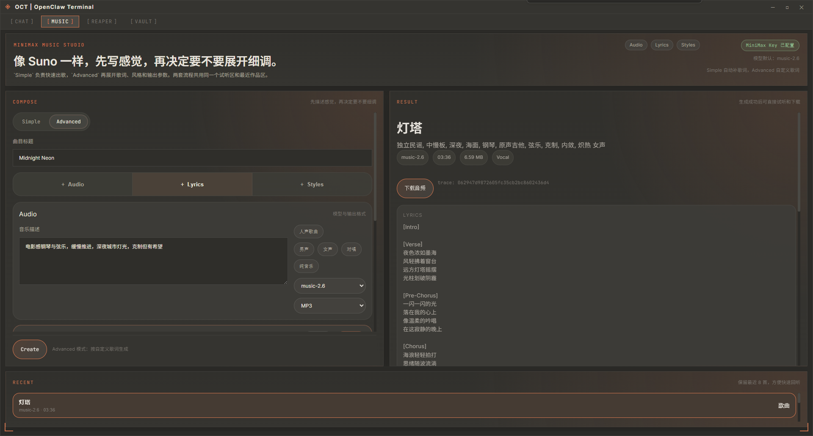
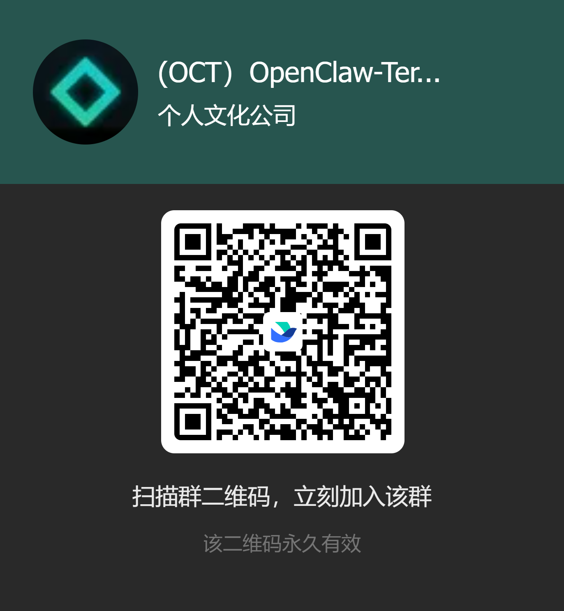

# OCT 桌面终端

> 会聊天、会执行、会出图的 AI 桌面终端

[](https://opensource.org/licenses/MIT)
[](https://github.com/zl585451/openclaw-terminal/releases)
[](https://github.com/zl585451/openclaw-terminal/releases)

---

## 🎯 产品简介

OCT (OpenClaw Terminal) 是一个面向中文用户的 AI 桌面客户端。你可以像聊天一样交代任务，让它整理信息、调用工具、生成图表、在 Canvas 中输出结构化成果，还能直接进入音乐工作台做音乐生成。

**核心理念**：一个真正能执行任务的终端窗口，你说它做。

---

## 🚀 一句话认识 OCT

**不是只会回答问题，而是能把结果直接做出来。**  
聊天、工具调用、Canvas、Image Studio、Music Studio，在一个桌面窗口里完成。



---

## ✨ 为什么值得下载

| 亮点 | 说明 |
|------|------|
| 结果导向 | 不只聊天，还会把图、表、结构化结果和图片直接做出来 |
| 独立工作台 | `Image Studio` / `Music Studio` 与聊天区并存，适合真正做事 |
| 桌面端一体化 | 配置、生成、预览、下载、回填结果都在一个窗口内完成 |

---

## 🆕 v0.2.2 核心能力

| 功能 | 说明 |
|------|------|
| 💬 智能对话 | 和 AMY 聊天，支持结构化回答、表格优先、上下文记忆 |
| 🧩 Canvas 工作区 | 图表、结构图、文档草稿、代码草稿统一落到 Canvas |
| 🎵 Music Studio | MiniMax `music-2.6` 工作台，支持 `Simple / Advanced`、自动写词、试听与下载 |
| 🖼️ 图片能力 | 图片理解、图片生成、截图上传、文件图片附件 |
| 🔧 开发助手 | 代码生成、终端命令、Git 辅助、文件读写 |
| 🌐 工具集成 | Web 搜索、HTTP 请求、邮件读取、验证码查询 |
| 🔐 保险箱 | 安全保存 API Key 和常用凭证 |
| 🤖 自动执行 | 后台任务、任务队列、工具调用事件流 |
| 🚀 首启引导 | 安装后首次启动自动引导填写 API Key，降低新手门槛 |

---

## 🖼️ 使用场景

### 1. 问一句，直接给出表格和图表

OCT 不只是把答案打出来，还能把结果落到 Canvas / 图表工作区，让信息更容易理解和复用。



### 2. 在侧栏直接出图，不污染聊天上下文

`Image Studio` 是独立文生图工作台。你可以让 AMY 优化提示词，然后直接生成、预览、下载、打开原图，最后再把图片插回聊天记录。

### 3. 继续创作音乐，不用切工具

除了聊天和出图，OCT 还内置 `Music Studio`，可以继续做歌词、风格和成品试听的创作流程。



---

## 📦 下载安装

**最新稳定版本**：`v0.2.2`

| 平台 | 安装包 | 大小 |
|------|--------|------|
| 🪟 Windows | [OCT-Setup-v0.2.2.exe](https://github.com/zl585451/openclaw-terminal/releases/download/v0.2.2/OCT-Setup-v0.2.2.exe) | 约 356 MB |
| 🍎 Mac Intel | [OCT-0.2.2-Mac-x64.dmg](https://github.com/zl585451/openclaw-terminal/releases/download/v0.2.2/OCT-0.2.2-Mac-x64.dmg) | 约 248 MB |
| 🍎 Mac Apple Silicon | [OCT-0.2.2-Mac-arm64.dmg](https://github.com/zl585451/openclaw-terminal/releases/download/v0.2.2/OCT-0.2.2-Mac-arm64.dmg) | 约 243 MB |
| 🐧 Linux AppImage | [OCT-0.2.2-Linux-x86_64.AppImage](https://github.com/zl585451/openclaw-terminal/releases/download/v0.2.2/OCT-0.2.2-Linux-x86_64.AppImage) | 约 254 MB |
| 🐧 Linux Debian | [OCT-0.2.2-Linux-amd64.deb](https://github.com/zl585451/openclaw-terminal/releases/download/v0.2.2/OCT-0.2.2-Linux-amd64.deb) | 约 216 MB |

> macOS 当前为未签名 DMG。首次打开时如被系统拦截，请右键应用选择“打开”，或在系统设置中手动放行。

### v0.2.2 更新重点

- 新增 `Image Studio` 独立生图工作台，图片生成与聊天主链路正式解耦
- 支持侧栏直接生成、预览、下载、打开原图，并将生成结果插回聊天记录
- AMY 提示词优化回填更稳定，兼容部分模型输出的 CoT / 说明文字
- 生图控制面板统一为跨供应商主语义：画幅、风格倾向、质量、Seed、提示词优化、水印、高级尺寸
- 经过验证后主动下线图生图，当前聚焦稳定文生图体验
- Image Studio 新增显式“返回聊天”按钮，并支持 `Esc` 快捷退出

---

## 🚀 首次使用

1. 安装对应平台的安装包并启动 OCT。
2. 第一次启动时，客户端会弹出设置引导。
3. 推荐先配置 `DeepSeek API Key`，也支持阿里云百炼、MiniMax 等服务商。
4. 配好 Key 后即可开始聊天、出图、调用工具或进入 `MUSIC` 工作台。

---

## 🛠️ 本地开发

```bash
npm install
npm run init
npm run electron:dev
```

常用命令：

- `npm run build`
- `npx tsc --noEmit`
- `npx vitest run`

---

## 💬 加入社群

欢迎加入飞书交流群，获取最新动态、版本测试和使用帮助。



---

## 🛠️ 技术栈

| 模块 | 技术 |
|------|------|
| 前端框架 | React 18 + TypeScript |
| 桌面框架 | Electron 28 |
| 构建工具 | Vite 5 |
| 终端组件 | xterm 5 |
| Markdown | react-markdown |
| 国际化 | i18next |

---

## 📄 许可证

MIT License

---

## 👥 作者

OCT Team

---

**OpenClaw Terminal · 让电脑听懂你的话，也替你把事做下去**
