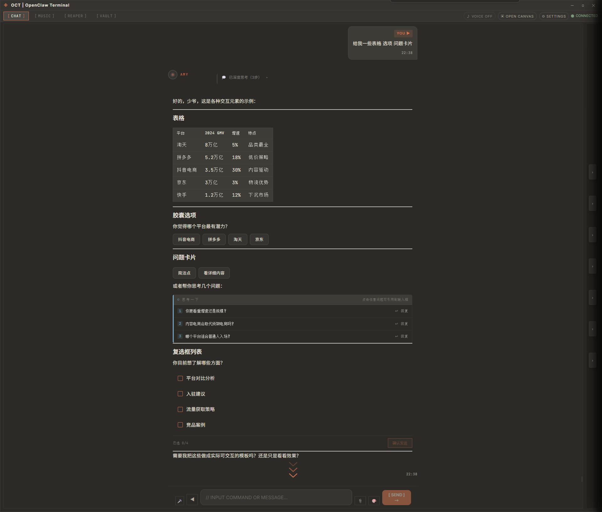

# OCT Terminal

> Windows 桌面 AI 助手 —— 聊天、出图、执行任务，一个窗口搞定

[](https://opensource.org/licenses/MIT)
[](https://github.com/zl585451/openclaw-terminal/releases)
[](https://github.com/zl585451/openclaw-terminal/releases)

---

## 这是什么

OCT（OpenClaw Terminal）是一个 Windows 桌面 AI 客户端。跟普通聊天机器人不同，它不只是回答问题——还能直接帮你**生成图表、出图、执行系统命令、读写文件、搜索网页**，所有操作都在一个桌面窗口里完成。

跟 AMY 聊天，她就能替你把事做了。



---

## 能做什么

### 对话与信息处理
- **多模型支持**：DeepSeek、阿里云百炼、MiniMax、Google Gemini、自定义 OpenAI 兼容服务，在设置里自由切换
- **流式打字机效果**：回复逐字呈现，体验跟主流 Chat 产品一致
- **结构化输出**：表格、列表、代码块自动排版，不会被大段文字刷屏
- **执行过程可见**：思考状态、工具调用、后台任务进度会在界面中清楚呈现，每个工具调用都标注「谁执行的」（AMY 本身 / 子代理），参数与结果支持展开看全量
- **上下文记忆**：本地文件存储记忆，跨会话保持重要信息

### 可视化 & 工作台
- **图表生成**：AI 直接输出 ECharts 图表（柱状图、饼图、折线图等），可交互查看
- **结构图**：自动生成 Mermaid 流程图、React Flow 关系图
- **边生成边预览**：画布内容（HTML/SVG/Mermaid 等）流式生成时实时渲染，不用等全部写完才显示
- **文档工作台**：长文写作、结构化文档，带字数统计和阅读时间估算
- **代码高亮**：支持语法高亮和代码块展示


### 图片能力
- **Image Studio**：侧栏独立文生图工作台，支持提示词优化、预览、下载
- **图片理解**：上传图片让 AI 识别内容（截图、照片、文档等）
- **多服务商**：MiniMax、SiliconFlow 等图片生成服务


### 工具执行
- **35+ 内置工具**：网页搜索、网页抓取、文件读写、终端命令、HTTP 请求、邮件操作
- **MCP 协议支持**：可接入外部 MCP Server，扩展工具能力
- **后台任务**：耗时任务异步执行，不阻塞对话
- **保险箱**：安全保存 API Key 和常用凭证

### 语音
- **TTS 朗读**：AI 回复自动语音播报，可在设置中开关
- **语音输入**：支持中文语音识别转文字

---

## 下载安装

最新版本：**v0.2.7**

| 平台 | 说明 |
|------|------|
| 🪟 Windows | NSIS 安装包（.exe），支持自定义安装路径 |
| 🍎 macOS | 已配置 DMG 打包，实际可用版本请以 Releases 页面为准 |
| 🐧 Linux | 已配置 AppImage / Debian 打包，实际可用版本请以 Releases 页面为准 |

👉 **[前往 Releases 页面下载](https://github.com/zl585451/openclaw-terminal/releases)**

> macOS 当前为未签名 DMG，首次打开如被拦截，请右键 → "打开"，或在系统设置中手动放行。

---

## 首次使用

1. 下载安装对应平台包，启动 OCT。
2. 首次启动自动弹出设置引导，推荐先配置 **DeepSeek API Key**（也支持百炼、MiniMax、Google Gemini 等）。
3. 配好 Key 即可开始对话、出图、或调用工具。

---

## 本地开发

```bash
# 安装依赖
npm install

# 初始化本地配置
npm run init

# 启动开发模式（Electron + Vite）
npm run electron:dev
```

其他常用命令：

| 命令 | 说明 |
|------|------|
| `npm run dev` | 仅启动 Vite 前端 |
| `npm start` | 构建 Electron 后启动桌面应用 |
| `npm run build` | 生产构建 |
| `npm test` | 运行测试 |
| `npm run electron:build:win` | 打包 Windows 安装包 |

---

## 架构概览

```
┌─ Electron 桌面壳 ─────────────────────────────┐
│  React 18 + TypeScript + Vite 5               │
│  聊天 · Canvas · Image Studio · 设置 · TTS    │
│                                                │
│  ┌─ oct-gateway (Node 子进程) ──────────────┐ │
│  │  WebSocket 通信 · 工具执行 · 会话管理     │ │
│  │  OmniRoute 模型路由 · Memory v2 记忆      │ │
│  │  MCP 协议 · 后台任务队列                  │ │
│  └──────────────────────────────────────────┘ │
│                      ↕                         │
│         DeepSeek / 百炼 / MiniMax / Gemini     │
└────────────────────────────────────────────────┘
```

- **前端**：React 18 + TypeScript，Vite 5 构建，xterm 5 终端组件
- **桌面框架**：Electron 28
- **网关**：独立 Node 子进程，WebSocket 通信，30+ 内置工具，MCP 客户端
- **模型路由**：OmniRoute 统一管理多 provider 切换与 fallback
- **记忆系统**：Memory v2 本地文件存储（`~/.openclaw/memory`）
- **渲染协议**：Render Protocol v3 结构化输出

---

## 可选能力

以下模块为可选/按需加载，不影响核心聊天功能：

| 模块 | 说明 | 状态 |
|------|------|------|
| Script Adapter | 长内容创作工作台（有声书、剧本等） | 按需加载 |
| AI.library | 专业知识库检索 | 按需加载 |
| Music Studio | 音乐生成工作台 | 实验阶段 |
| 可选工具集 | `oct-gateway/optional-tools/` | 按需加载，随包携带依赖 |

---

## 适合谁用

- 🧑‍💻 想要一个**能真正执行任务**而不只是聊天的桌面 AI 助手
- 🎨 需要快速**出图、出图表、出结构图**，不想在多个工具间切换
- 🛠️ 希望用自然语言**操作电脑**（读文件、跑命令、搜网页）
- 🇨🇳 偏好中文交互、国内可直接使用的 AI 服务

当前 OCT 主要面向 **Windows 用户**，macOS / Linux 版本持续跟随更新。

---

## 技术栈

| 模块 | 技术 |
|------|------|
| 前端框架 | React 18 + TypeScript |
| 桌面框架 | Electron 28 |
| 构建工具 | Vite 5 |
| 终端组件 | xterm 5 |
| 图表 | ECharts 6 / React Flow |
| Markdown | react-markdown + KaTeX + Mermaid |
| 网关 | Node.js + WebSocket |
| 记忆存储 | better-sqlite3 + sqlite-vec |
| 测试 | Vitest + Testing Library |

---

## 许可证

MIT License

---

**OCT Terminal · 让电脑听懂你的话，也替你把事做了**
