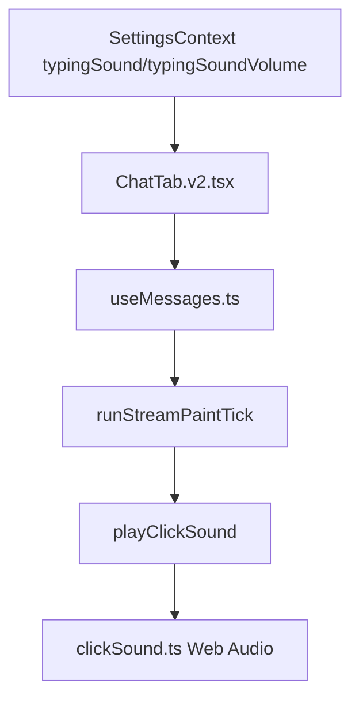
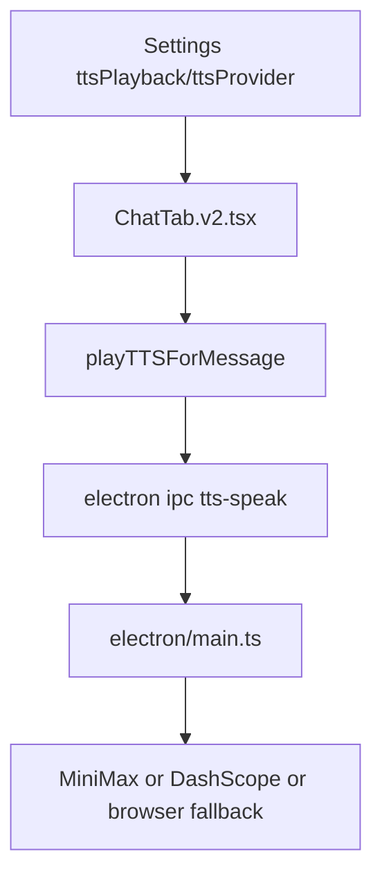

# Audio Entry

> Status: CURRENT  
> Last Updated: 2026-04-19  
> Scope: 打字音效、TTS 两条声音相关链路

> 2026-04-21 更新：移除已废弃的 ASR 录音转文字链路描述  
> 当前仅保留：打字音效 + TTS

---

## 先分清两条链

1. 打字音效：聊天流式显示时的短提示音
2. TTS：AI 回复结束后整段朗读

不要把这两条链混在一起查。当前产品主链路里已经没有 ASR / 录音转文字入口。

---

## 打字音效链路

### 优先阅读文件

1. `src/contexts/SettingsContext.tsx`
2. `src/ui/settings/tabs/InterfaceTabView.tsx`
3. `src/hooks/useMessages.ts`
4. `src/utils/clickSound.ts`
5. `src/ui/chat/ChatTab.v2.tsx`

### 关键事实

- 当前打字音效已经挂到 `useMessages.ts -> runStreamPaintTick`
- `useTypewriter.ts` 不再是当前打字音效主入口
- `clickSound.ts` 使用 `Web Audio` 实时合成，不依赖音频文件

### 常见问题

| 现象 | 先查 |
|---|---|
| 完全没声音 | `typingSound !== off`、`typingSoundVolume`、`AudioContext.resume()` |
| 有时响有时不响 | 是否真的走了 `runStreamPaintTick`；是否在非流式场景测试 |
| 声音太小 | `typingSoundVolume` 和 `clickSound.ts` 增益 |

---

## TTS 链路

### 优先阅读文件

1. `src/ui/chat/ChatTab.v2.tsx`
2. `src/ui/settings/tabs/InterfaceTabView.tsx`
3. `electron/main.ts`
4. `electron/preload.ts`

---

## 日志关键词

- 打字音效：前端无专门日志，先看设置值和实际流式显示链
- TTS：`TTS`、`MiniMax TTS`、`audio play`

## 当前不在排查范围

- `ASR`
- `speechToText`
- `recordAndTranscribe`
- `asr-transcribe`

如果你是按旧记忆在找录音转文字链路，先停止；该链路已在 2026-04-19 从产品主链路移除。

