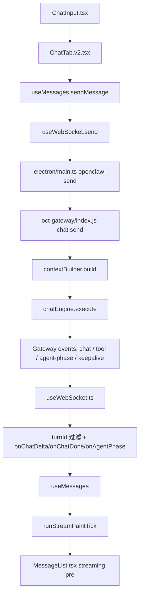

# Chat Stream Entry

> Status: CURRENT  
> Last Updated: 2026-04-19  
> Scope: 聊天发送、Gateway 回复、前端流式显示、状态切换、打字动画主链路

---

## 一句话定位

当前聊天主链路的真实“流式显示入口”是 `src/hooks/useMessages.ts`，但排查时不能只盯 `runStreamPaintTick`，还要同时看 `useWebSocket.ts` 的 `turnId` 过滤、`agent-phase` 和 `keepalive` 事件。

---

## 主链路图

---

## 优先阅读文件

1. `src/hooks/useMessages.ts`
2. `src/hooks/useWebSocket.ts`
3. `src/ui/chat/MessageList.tsx`
4. `src/ui/chat/ChatTab.v2.tsx`
5. `electron/main.ts`
6. `oct-gateway/index.js`

---

## 各文件职责

### `src/ui/chat/ChatTab.v2.tsx`
- 聊天页宿主
- 把 `settings`、`messages`、`useMessages`、`MessageList` 串起来
- 这里只是装配层，不是主流式逻辑实现层

### `src/hooks/useMessages.ts`
- 当前聊天状态核心
- 负责：
  - `sendMessage` / `quickSend`
  - 处理 `useWebSocket` 入站回调
  - `runStreamPaintTick` 直接往流式 DOM 写 `textContent`
  - streaming assistant 占位消息、收尾 finalize、usage 累积
- 聊天显示/打字音效/流式收尾问题，先看这里

### `src/hooks/useWebSocket.ts`
- 负责 Electron IPC → renderer 的消息适配
- 解析 `openclaw-message`
- 区分 `chat` / `tool` / `agent-phase` / `keepalive` / `workbench` / `canvas`(兼容)
- 读取 `turnId`，避免别的轮次事件串进当前消息

### `src/ui/chat/MessageList.tsx`
- 负责最终展示
- 流式消息使用 `streamingDomRef + <pre>` 承接 `useMessages` 的 DOM 直写
- `usePlainStreamingText={true}` 时，显示不再依赖 React 逐字渲染

### `electron/main.ts`
- `openclaw-send` IPC 真正把消息发给 gateway
- WebSocket 客户端，负责收 gateway 消息再转发给 renderer

### `oct-gateway/index.js`
- `chat.send` 路由入口
- 生成 `turnId`
- 先调 `contextBuilder.build()` 拼装上下文
- 再调 `chatEngine.execute()` 驱动真正的流式回复
- 发送 `chat`、`tool`、`agent-phase`、`keepalive` 事件

---

## 关键事实

- `useTypewriter.ts` 仍存在，但 `ChatTab.v2.tsx` 中当前是 `enabled: false`
- 真实的字符逐步显示由 `useMessages.ts -> runStreamPaintTick` 驱动
- `useMessages.ts` 会按 `turnId` 过滤 delta / done，排查串流问题必须看这一层
- Gateway 已把中间状态拆成 `agent-phase` 与 `keepalive`，不要再把所有“卡住”都归结到 paint tick
- 如果“界面在打字，但某个依赖旧打字机的功能没生效”，优先怀疑职责迁移不完整
- 从 2026-04-17 起，连接成功后 `hello-ok.capabilities` 会透传到前端（用于工具能力提示）
- 从 2026-04-17 起，`useMessages` 增加整轮超时兜底（默认 10 分钟），防止无限 awaitingResponse
- 从 2026-04-18 起，Gateway 对 `custom` provider 的 `kimi` 家族模型默认不强制发送 `temperature`，减少 OpenAI 兼容端点 `invalid temperature` 400

---

## 常见问题先查哪里

| 现象 | 先查 |
|---|---|
| 收到 delta 但界面不更新 | `useWebSocket.ts` → `useMessages.ts:onChatDelta` |
| 某一轮消息串到另一轮里 | `turnId` 生成与 `useMessages.ts` 过滤 |
| 界面瞬间整坨出现，不是逐字 | `useMessages.ts:runStreamPaintTick` |
| 流结束后留空白 assistant 占位 | `useMessages.ts:onChatDone` / finalize fallback |
| 打字音效和界面不同步 | `useMessages.ts`，不要先查 `useTypewriter.ts` |
| thinking / typing 状态错乱 | `useWebSocket.ts:onAgentPhase` + `keepalive` + `useMessages.ts` |

