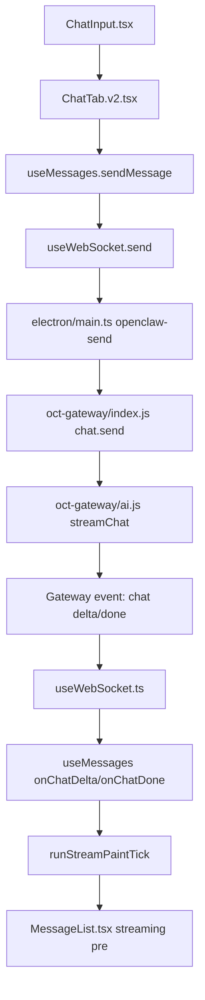

# Chat Stream Entry

> Status: CURRENT  
> Last Updated: 2026-04-08  
> Scope: 聊天发送、Gateway 回复、前端流式显示、状态切换、打字动画主链路

---

## 一句话定位

当前聊天主链路的真实“流式显示入口”是 `src/hooks/useMessages.ts`，不是 `useTypewriter.ts`。

---

## 主链路图

---

## 优先阅读文件

1. `src/hooks/useMessages.ts`
2. `src/hooks/useWebSocket.ts`
3. `src/ui/chat/MessageList.tsx`
4. `src/ui/chat/ChatTab.v2.tsx`
5. `electron/main.ts`
6. `oct-gateway/index.js`

---

## 各文件职责

### `src/ui/chat/ChatTab.v2.tsx`
- 聊天页宿主
- 把 `settings`、`messages`、`useMessages`、`MessageList` 串起来
- 这里只是装配层，不是主流式逻辑实现层

### `src/hooks/useMessages.ts`
- 当前聊天状态核心
- 负责：
  - `sendMessage` / `quickSend`
  - 处理 `useWebSocket` 入站回调
  - `runStreamPaintTick` 直接往流式 DOM 写 `textContent`
  - streaming assistant 占位消息、收尾 finalize、usage 累积
- 聊天显示/打字音效/流式收尾问题，先看这里

### `src/hooks/useWebSocket.ts`
- 负责 Electron IPC → renderer 的消息适配
- 解析 `openclaw-message`
- 区分 delta / done / usage / agent-phase / tool / workbench / canvas(兼容)

### `src/ui/chat/MessageList.tsx`
- 负责最终展示
- 流式消息使用 `streamingDomRef + <pre>` 承接 `useMessages` 的 DOM 直写
- `usePlainStreamingText={true}` 时，显示不再依赖 React 逐字渲染

### `electron/main.ts`
- `openclaw-send` IPC 真正把消息发给 gateway
- WebSocket 客户端，负责收 gateway 消息再转发给 renderer

### `oct-gateway/index.js`
- `chat.send` 路由入口
- 拼装上下文、记忆注入、图片分支、调用 `streamChat`

---

## 关键事实

- `useTypewriter.ts` 仍存在，但 `ChatTab.v2.tsx` 中当前是 `enabled: false`
- 真实的字符逐步显示由 `useMessages.ts -> runStreamPaintTick` 驱动
- 如果“界面在打字，但某个依赖旧打字机的功能没生效”，优先怀疑职责迁移不完整

---

## 常见问题先查哪里

| 现象 | 先查 |
|---|---|
| 收到 delta 但界面不更新 | `useWebSocket.ts` → `useMessages.ts:onChatDelta` |
| 界面瞬间整坨出现，不是逐字 | `useMessages.ts:runStreamPaintTick` |
| 流结束后留空白 assistant 占位 | `useMessages.ts:onChatDone` / finalize fallback |
| 打字音效和界面不同步 | `useMessages.ts`，不要先查 `useTypewriter.ts` |
| thinking / typing 状态错乱 | `useWebSocket.ts:onAgentPhase` + `useMessages.ts` |

