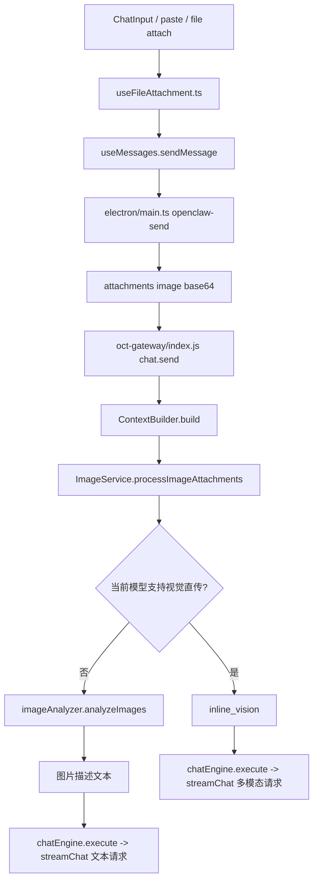

# Image Flow Entry

> Status: CURRENT  
> Last Updated: 2026-04-21  
> Scope: 截图/图片附件发送、gateway 路由、视觉直传与图片描述降级

---

## 一句话定位

当前图片链路不是单一路径，而是：

- 视觉模型：直接 `image_url` 直传
- 非视觉模型：先经 `ImageService` 路由，再由 `imageAnalyzer` 生成图片描述并按文本链路发送

---

## 主链路图

---

## 优先阅读文件

1. `src/hooks/useFileAttachment.ts`
2. `src/ui/chat/ChatInput.tsx`
3. `electron/main.ts`
4. `oct-gateway/index.js`
5. `oct-gateway/runtime/contextBuilder.js`
6. `oct-gateway/services/imageService.js`
7. `oct-gateway/image_analyzer.js`
8. `oct-gateway/runtime/chatEngine.js`

---

## 各文件职责

### `src/hooks/useFileAttachment.ts`
- 处理粘贴、拖拽、截图后的附件读取
- 图片会保留 `base64`

### `electron/main.ts`
- `openclaw-send` 把 `imageDataUrl/files` 转成 `attachments`
- 图片附件格式：
  - `{ type: 'image', mimeType, content: base64 }`

### `oct-gateway/index.js`
- 创建 `ImageService`，并把它注入 `ContextBuilder`
- `chat.send` 进入 `contextBuilder.build()`，不再直接手写图片分支

### `oct-gateway/runtime/contextBuilder.js`
- 在 `build()` 中收集 `imageAttachments`
- 统一调用 `imageService.processImageAttachments(...)`
- 把返回结果并入最终 `messageContent`

### `oct-gateway/services/imageService.js`
- 当前图片路由服务层
- 记录 `image request routing` 日志
- 判断视觉直传 vs 描述降级
- 非视觉模型时再调用 `imageAnalyzer.analyzeImages(...)`

### `oct-gateway/image_analyzer.js`
- 图片描述能力实现层
- 只在 `ImageService` 选择降级路径时触发

### `oct-gateway/runtime/chatEngine.js`
- 最终统一执行聊天请求
- 无论是视觉直传还是文字降级，最后都从这里进入 `streamChat`

---

## 关键日志关键词

排错时优先搜这些：

- `image request routing`
- `image attachments normalized to text context`
- `ImageAnalyzer`
- `HTTP 529`
- `stream interrupted`

---

## 当前规则

### 视觉模型
- 保留多模态内容
- 直接把 `image_url` 传给模型

### 非视觉模型
- 先进入 `ImageService`
- 再由 `ImageService` 调 `imageAnalyzer.analyzeImages()`
- 把结果拼进文本上下文
- 避免图片直传把主文本模型流式回复打断

**降级链路（所有 provider 通用）：**
1. DashScope 云端（仅 provider=bailian/bailian-coding 时）
2. 视觉 API（`VISION_API_KEY` + `VISION_BASE_URL` + `VISION_MODEL`，独立配置，与主 provider 无关）
3. MCP `understand_image`（最后兜底）
4. 降级提示

> 本地 BLIP 已于 2026-04-13 移除。推荐在设置面板配置「图片理解 API」（硅基流动免费 VL 模型）。

### hypothesis
- 图片消息默认不再触发 hypothesis 支线请求
- 目的是降低竞态和空流 done 风险

---

## 常见问题先查哪里

| 现象 | 先查 |
|---|---|
| 发图后完全无响应 | `electron/main.ts` 是否生成了 image attachments |
| 发图后 AI 直接失败 | `oct-gateway/index.js` 的图片路由日志 |
| 发图时遇到 529 / 空流 | `oct-gateway/ai.js` + provider 负载，先确认是否直传到非视觉模型 |
| 图片描述很差 | `oct-gateway/image_analyzer.js` 云端/本地实际命中路径 |

