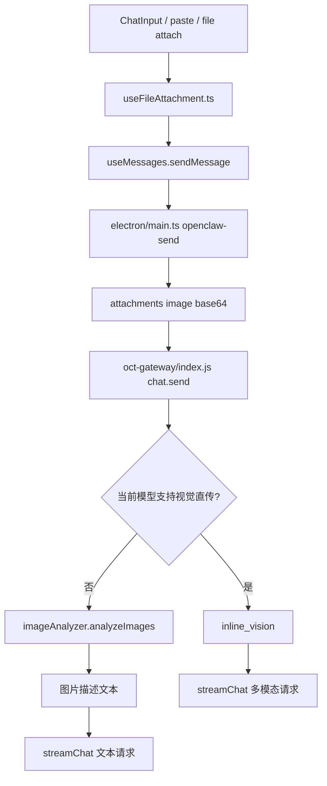

# Image Flow Entry

> Status: CURRENT  
> Last Updated: 2026-04-08  
> Scope: 截图/图片附件发送、gateway 路由、视觉直传与图片描述降级

---

## 一句话定位

当前图片链路不是单一路径，而是：

- 视觉模型：直接 `image_url` 直传
- 非视觉模型：先 `imageAnalyzer` 生成图片描述，再按文本链路发送

---

## 主链路图

---

## 优先阅读文件

1. `src/hooks/useFileAttachment.ts`
2. `src/ui/chat/ChatInput.tsx`
3. `electron/main.ts`
4. `oct-gateway/index.js`
5. `oct-gateway/image_analyzer.js`
6. `oct-gateway/ai.js`

---

## 各文件职责

### `src/hooks/useFileAttachment.ts`
- 处理粘贴、拖拽、截图后的附件读取
- 图片会保留 `base64`

### `electron/main.ts`
- `openclaw-send` 把 `imageDataUrl/files` 转成 `attachments`
- 图片附件格式：
  - `{ type: 'image', mimeType, content: base64 }`

### `oct-gateway/index.js`
- `chat.send` 中检测 `imageAttachments`
- 记录 `image request routing` 日志
- 根据当前模型决定：
  - `inline_vision`
  - `image_analyzer_fallback`

### `oct-gateway/image_analyzer.js`
- 云端/本地图片描述降级链路
- 当前已补充分段日志

### `oct-gateway/ai.js`
- 最终统一走 `streamChat`
- 如果是视觉模型直传，消息内容里会带 `image_url`

---

## 关键日志关键词

排错时优先搜这些：

- `image request routing`
- `image attachments normalized to text context`
- `ImageAnalyzer`
- `HTTP 529`
- `stream interrupted`

---

## 当前规则

### 视觉模型
- 保留多模态内容
- 直接把 `image_url` 传给模型

### 非视觉模型
- 先 `imageAnalyzer.analyzeImages()`
- 把结果拼进文本上下文
- 避免图片直传把主文本模型流式回复打断

### hypothesis
- 图片消息默认不再触发 hypothesis 支线请求
- 目的是降低竞态和空流 done 风险

---

## 常见问题先查哪里

| 现象 | 先查 |
|---|---|
| 发图后完全无响应 | `electron/main.ts` 是否生成了 image attachments |
| 发图后 AI 直接失败 | `oct-gateway/index.js` 的图片路由日志 |
| 发图时遇到 529 / 空流 | `oct-gateway/ai.js` + provider 负载，先确认是否直传到非视觉模型 |
| 图片描述很差 | `oct-gateway/image_analyzer.js` 云端/本地实际命中路径 |

