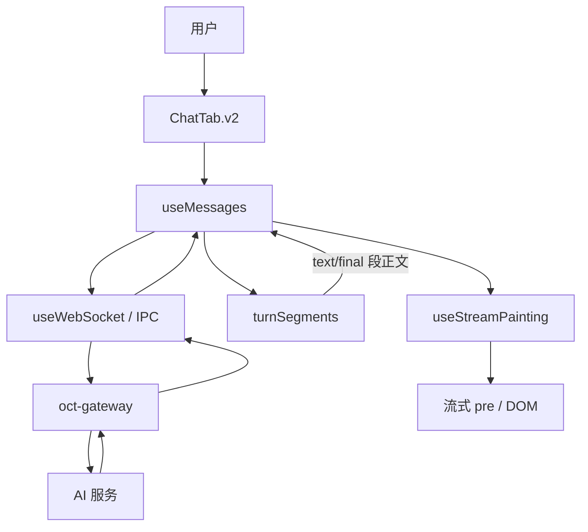

# AI 架构全景（OCT）

> 读者：需要做架构级改动、或串联全链路时的 AI / 维护者。  
> Last Updated: 2026-04-29

---

## 1. 系统架构与数据流（Mermaid）

以下为逻辑视图；真实 IPC 与网关端口见 `AGENTS.md`。流式返回在代码里由 `useMessages` 消费 `chat.seg` 段事件并驱动 `useStreamPainting`，图中将段状态与 Hook 画在一起权作「段归约 → 绘制」两段。

**文字补充**：出站由 `send` 经主进程与网关对话；入站段事件在 `useMessages` 内归约为 `turnSegments`，text/final 段更新完整正文 ref，再由 RAF 在 `useStreamPainting` 落屏。TurnFSM 负责回合生命周期，`turnUiState` 负责 UI 状态呈现。

---

## 2. 核心模块职责表

| 模块 | 位置 | 职责 | 高风险 |
|------|------|------|--------|
| TurnFSM | `src/core/turnFSM/` | 显式边会话状态机：从用户输入到流结束、渲染完成、回合结束回到 IDLE | ⚠️ |
| turnSegments | `src/core/turnSegments.ts` | 归约网关段事件，维护助手可见正文的 text/final 段事实源 | ⚠️ |
| turnUiState | `src/core/turnUiState.ts` | UI 状态/活动投影，避免把展示状态混进生命周期 FSM | |
| StreamRouter | `src/core/streamRouter/` | 隔离核心模块：缓冲 token、定时 flush；当前不挂在生产聊天主链路 | |
| blockRouter | `src/core/blockRouter.ts` | 将 Markdown 字符串切成 code/text 等块，供 legacy option/task 解析与相关测试 | |
| ScrollAnchor | `src/core/viewport/` | 消息列表锚点、用户上滑检测、reconcile | |
| useMessages | `src/hooks/useMessages.ts` | 回合编排、网关事件分发、消息列表与工具/活动时间线、 sendMessage | ⚠️ |
| useWebSocket | `src/hooks/useWebSocket.ts` | `openclaw-send` 与事件解析；连接/重试/Memory v2 状态 | |
| useStreamPainting | `src/hooks/useStreamPainting.ts` | RAF 按预算向 DOM 写字，收尾 finalize 与滚动/音效 | |
| ChatTab.v2 | `src/ui/chat/ChatTab.v2.tsx` | 主界面组合：输入、列表、侧栏、能力/引导等 | ⚠️ 禁止继续堆功能，宜拆分 |
| oct-gateway | `oct-gateway/` | Node 网关：路由、会话、调用各 Provider、工具与可选内存服务 | |

---

## 3. 提示词来源

- **`docs/01_system_prompts/`**：维护时的**单一事实源**，说明身份、行为与版本意图应在此落笔。  
- **`resources/system_prompts/`**：**运行时镜像**（打包/加载用），**不要直接当编辑目标**；改文案以 docs 为准，再按项目流程同步产物。

---

## 4. `src/core/__tests__/` 测试覆盖现状

| 测试文件 | 主要覆盖 |
|----------|----------|
| `turnFSM.test.ts` | `TurnFSM` 合法语义链、`transition` 非法边、`deriveLegacyFlags` 等 |
| `streamRouter.test.ts` | `StreamRouter` 全生命周期状态、`flush`、与 FSM 联动、`deriveStreamFlags` 等 |
| `blockRouter.test.ts` | `blockRouter` 纯文本/代码块/混合内容及 block id |
| `scrollAnchor.test.ts` | `ScrollAnchor`（`src/core/viewport/`）锁定/释放与 drift reconcile |

**说明**：`src/core/` 下尚有其它单测（例如 `clarifyCard/parser.test.ts`），不在上述目录内；Hook 与 UI 层覆盖以仓库根 `npm test` / Vitest 配置为准。

---

## 5. 延伸阅读

- Hook 级职责：`docs/02_architecture/HOOKS_MAP.md`  
- 首次接手导读：`docs/00_ai_entry/README.md`  
- 协议与端口：`docs/03_specs/WEBSOCKET_PROTOCOL.md`（若与实现并列）、`AGENTS.md`
