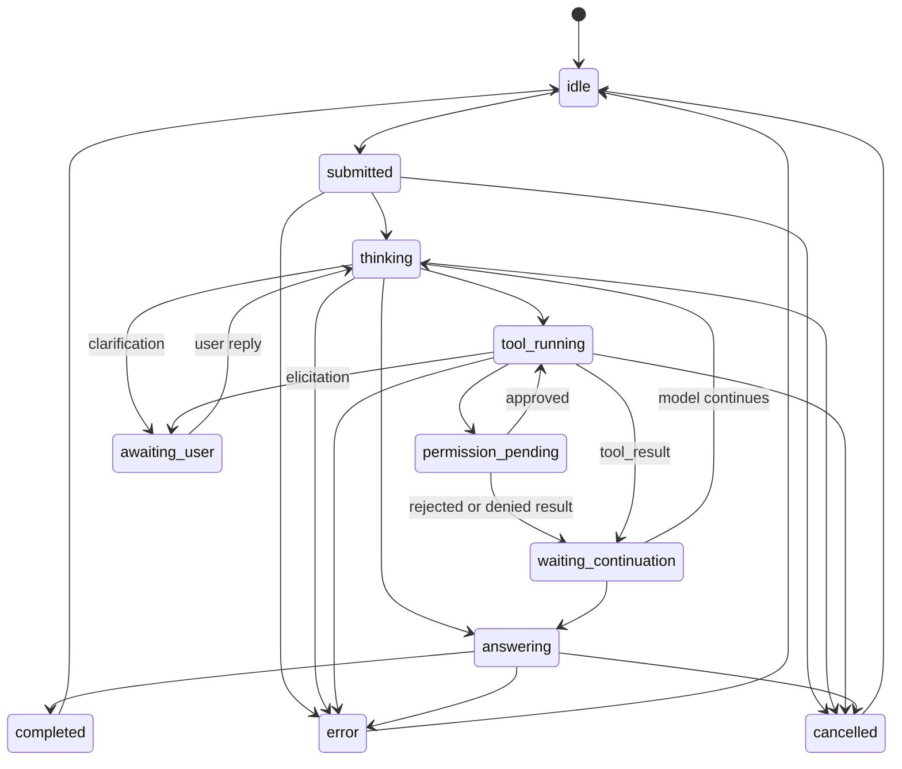

# Claude Desktop-like UI State Machine vs OCT

Date: 2026-06-17

Scope: this is a frontend interaction alignment note. It is not a proposal to make
OCT use Claude Desktop's MCP client or Claude's private implementation.

## Executive Summary

Claude Desktop's internal UI state machine is not publicly documented. The public
sources expose observable behavior: MCP server discovery, tool approval, tool
execution, tool results returned to the model, logs, dynamic tool status, and
some Claude Code MCP UI behavior. Therefore, the useful target for OCT is not
"clone Claude Desktop internals", but a Claude-like turn lifecycle:



OCT already has the most important foundation: backend turn segments
(`text`, `tool_use`, `tool_result`, `final`) and a frontend segment reducer.
The main gap is that OCT does not yet have one authoritative frontend turn UI
state. The current UI derives state from several independent streams:
`agentPhase`, `TurnPhase`, `awaitingResponse`, `toolEvents`, `turnSegments`,
`activityTimeline`, and `clarify` side-channel refs.

The practical optimization direction is to add a single `TurnUiState` projection
and make all message chrome, inline tool groups, activity panel, clarify UI, and
stream completion behavior consume that projection.

## External Evidence

| Area | Public evidence | Frontend implication for OCT |
| --- | --- | --- |
| Tool invocation loop | Anthropic's Messages tool-use docs say client tools run in the app: Claude returns `stop_reason: "tool_use"` with `tool_use` blocks, the app executes the tool, then returns `tool_result` blocks. Source: https://platform.claude.com/docs/en/agents-and-tools/tool-use/overview | UI should treat tool use as a first-class assistant turn substate, not as a generic spinner. |
| Desktop MCP approval | The MCP local server guide says Claude Desktop can expose local tools, and Claude requests approval before filesystem operations. Source: https://modelcontextprotocol.io/docs/develop/connect-local-servers | A Claude-like UI distinguishes "tool wants permission", "tool running", and "tool result returned". OCT can model this even without MCP. |
| Tool discovery/status | The same guide notes Claude Desktop shows an MCP server indicator in the input box and lets the user inspect available tools. Source: https://modelcontextprotocol.io/docs/develop/connect-local-servers | OCT can expose available local capabilities near composer/session chrome, separate from per-turn execution. |
| Logs and diagnosability | Claude Desktop MCP logs are documented under `%APPDATA%\Claude\logs` on Windows, including `mcp.log` and per-server logs. Source: https://modelcontextprotocol.io/docs/develop/connect-local-servers | OCT should keep tool/turn state diagnosable with stable event names and visible debug snapshots. |
| MCP architecture boundary | MCP architecture docs define hosts, clients, servers, JSON-RPC lifecycle, tools/resources/prompts, and transports, while explicitly saying MCP does not dictate how apps manage LLM workflows or context. Source: https://modelcontextprotocol.io/docs/learn/architecture | OCT should borrow interaction patterns, not assume MCP prescribes UI state. |
| Claude Code MCP panel | Claude Code docs describe `/mcp` status with connected server count, tools, pending approval, rejected state, dynamic tool updates, reconnect/backoff, output warnings, elicitation dialogs, resource references, and tool search. Source: https://code.claude.com/docs/en/mcp | These are good public analogues for UI state granularity: connected, pending approval, rejected, reconnecting, output-too-large, eliciting user input. |

Unknown: no official source found that publishes Claude Desktop's private React
state machine, reducer names, or exact UI event graph. All state diagrams in this
document are inferences from observable documented behavior.

## OCT Current Flow

### Backend event path

- `oct-gateway/runtime/chatRequestHandler.js` creates a `turnId`, emits
  `agent-phase`, `keepalive`, `tool`, `clarify`, and `chat` events.
- `tool_call` currently maps to keepalive phase `tool_running`, tool event
  `tool`, and `agent-phase: tool_executing`.
- `tool_result` currently maps to keepalive phase `waiting_continuation`, tool
  event `tool`, and `agent-phase: thinking`.
- `clarify_open` is sent as a `clarify` event and the handler ends with idle
  plus an empty chat done payload.
- `oct-gateway/runtime/chatEngine.js` bridges model streaming into callbacks and
  uses `TurnSegmentTracker` to emit segment snapshots.
- `oct-gateway/runtime/turnSegmentTracker.js` already models the content-block
  shape OCT needs: text chunks open/update text segments, `tool_call` opens a
  `tool_use` segment, `tool_result` closes it, and final done ends the turn.

### Frontend event path

- `src/hooks/useWebSocket.ts` routes server events to handlers:
  `agent-phase`, `tool`, `clarify`, `keepalive`, `chat` segment events,
  `chat` reset, and `chat` done.
- `src/hooks/useMessages.ts` owns the current practical turn state:
  `awaitingResponse`, `agentPhase`, `activeTools`, `fsmPhase`,
  `turnSegmentsRef`, segment protocol flags, timeout refs, clarify refs, and
  timeline refs.
- `src/core/turnSegments.ts` is the cleanest state reducer in the current design.
  It reduces segment events into ordered content segments without concatenating
  across segment boundaries.
- `src/ui/chat/MessageList.tsx` now renders consecutive `tool_use` segments as a
  grouped inline tool surface and uses text/final segments around tools as
  assistant prose.
- `src/components/ActivityPanel.tsx` and `src/hooks/useActivityTimeline.ts`
  still maintain a separate activity/timeline representation for thinking,
  keepalive hints, and tool call/result events.

## Ranked Gap Analysis

### P0: Missing authoritative turn UI state

Evidence: OCT currently spreads turn state across `agentPhase`, `TurnPhase`,
`awaitingResponse`, `toolEvents`, `turnSegments`, `activityTimeline`, clarify
refs, and timeout refs.

Impact: message header badges, inline tool groups, activity panel, empty-done
suppression, final-answer waiting, clarify pause, and timeout cleanup can drift.

Recommendation: introduce one projection type, for example:

```ts
type TurnUiPhase =
  | 'idle'
  | 'submitted'
  | 'thinking'
  | 'tool_running'
  | 'permission_pending'
  | 'waiting_continuation'
  | 'answering'
  | 'awaiting_user'
  | 'finalizing'
  | 'completed'
  | 'error'
  | 'cancelled';

type TurnUiState = {
  turnId: string | null;
  phase: TurnUiPhase;
  activeToolIds: string[];
  awaitingUser?: { kind: 'clarify' | 'elicitation'; promptId?: string };
  error?: { message: string; recoverable: boolean };
};
```

All visual affordances should derive from this projection.

### P0: Clarification is side-channel, not a persistent assistant turn state

Evidence: backend sends `clarify_open`, frontend calls `onClarifyOpen`, and
`onChatDone` suppresses an empty done message when `pendingClarifyOpenRef` is set.

Impact: the UI can pause correctly, but the state is not represented as a stable
assistant turn segment. This makes it harder to show a Claude-like "assistant is
waiting for your input" state inside the transcript.

Recommendation: represent clarify as either a `turn_state: awaiting_user` event
or a segment type such as `elicitation`/`clarify`. Keep the existing side-channel
for compatibility during migration.

### P1: Phase vocabulary is too narrow and partly inconsistent

Evidence: frontend `agentPhase` is typed as `idle | thinking | typing |
tool_executing`, while the gateway can forward `agent_status` values like
`agent_running`, `thinking`, and `idle`. Keepalive already contains richer
states such as `tool_running` and `waiting_continuation`.

Impact: UI code must infer important distinctions instead of rendering directly
from explicit turn states.

Recommendation: stop treating `agentPhase` as the canonical state. Either expand
it into `TurnUiState`, or keep it only as a backward-compatible display hint.

### P1: Inline tools and ActivityPanel now overlap

Evidence: `MessageList.tsx` hides tool activity panel entries when inline tools
exist, while `ActivityPanel` and `useActivityTimeline` still maintain tool call
and result entries.

Impact: two render paths describe the same tool lifecycle.

Recommendation: make inline `ToolGroup` the canonical tool execution renderer.
Use `ActivityPanel` primarily for thinking, keepalive/progress hints, and
non-inline debug detail.

### P1: Final-answer waiting is inferred from tool events

Evidence: `MessageList.tsx` computes `awaitingFinalAnswer` from streaming state,
agent phase, and whether all tool events are no longer executing.

Impact: this is close to Claude-like behavior, but it is brittle because the UI
should know "waiting for model continuation after tool result" explicitly.

Recommendation: emit or project `waiting_continuation` as a stable phase after
`tool_result`, and clear it only when the next text/reasoning/final segment
starts.

### P2: Missing visible states for approval, output limits, reconnect, and tool search

Evidence: public Claude Code MCP docs expose pending approval/rejected, dynamic
tool updates, reconnect/backoff, output-size warnings, elicitation dialogs,
resources, and tool search.

Impact: OCT does not need to copy all MCP features, but these states are useful
for a polished local-agent UX.

Recommendation: treat them as optional future UI states. Do not mix them into
the first refactor unless OCT already has matching backend events.

## Recommended Frontend Alignment Plan

### Phase 1: Add `TurnUiState` projection without changing visuals

Create a small reducer/projection near the existing segment reducer, for example
`src/core/turnUiState.ts`. Feed it the same events `useMessages` already handles:
send start, `agent-phase`, `keepalive`, `tool`, `clarify`, segment open/update/
close, reset, done, error, timeout, and cancel.

Acceptance:

- Existing chat behavior remains unchanged.
- Unit tests cover at least:
  - text-only answer
  - tool call -> tool result -> final answer
  - tool call -> error
  - clarify pause -> user reply
  - chat reset during streaming
  - timeout cleanup

### Phase 2: Replace scattered UI inference with the projection

Move message header badges, `awaitingFinalAnswer`, inline tool group running
state, and activity panel streaming state to consume `TurnUiState`.

Acceptance:

- No component independently guesses whether the turn is waiting for continuation
  after tools.
- `agentPhase` no longer decides canonical message lifecycle.

### Phase 3: Make clarification transcript-native

Add a persistent turn representation for clarify/elicitation:

- preferred: `TurnUiState.phase = 'awaiting_user'` plus `awaitingUser` metadata
- optional later: a segment type for renderable clarify content

Acceptance:

- No empty assistant done message is needed to simulate pause.
- Transcript visibly shows that the assistant is waiting for the user.

### Phase 4: Tighten tool UX around grouped segments

Build on the existing grouped tool rendering:

- one group per consecutive tool segment run
- stable collapsed summary after completion
- clear running, error, and rejected states
- no duplicate tool list in ActivityPanel when inline segment rendering exists

Acceptance:

- Consecutive tools read like one coherent work batch.
- The final answer starts after the tool group without layout jump.

### Phase 5: Add optional Claude-like capability surfaces

Only after the core state machine is stable:

- capability/server indicator near composer
- reconnect/backoff status for local tool providers
- output-size warning for very large tool results
- explicit approval/rejected state if OCT introduces permissioned local actions

## Proposed Event Vocabulary

OCT does not need a full protocol rewrite. A thin additive event can de-risk the
frontend:

```ts
type TurnStateEvent = {
  event: 'turn-state';
  payload: {
    turnId: string;
    phase:
      | 'submitted'
      | 'thinking'
      | 'tool_running'
      | 'waiting_continuation'
      | 'answering'
      | 'awaiting_user'
      | 'finalizing'
      | 'completed'
      | 'error'
      | 'cancelled';
    reason?: string;
    toolId?: string;
    promptId?: string;
    message?: string;
  };
};
```

Migration path:

1. Add reducer tests using synthetic events.
2. Derive `TurnUiState` from existing events first.
3. Add `turn-state` from gateway only after the UI projection is tested.
4. Keep `agent-phase` until old components stop consuming it.

## Bottom Line

OCT is closer to Claude-like interaction than it may look: segment tracking and
inline grouped tools already match the important "assistant turn contains tool
blocks" model. The next optimization should be state discipline, not more visual
surface area. A single tested turn UI state projection will make the chat feel
more like Claude Desktop because every visible element will agree on what the
assistant is doing: thinking, using tools, waiting for continuation, answering,
or waiting for the user.
