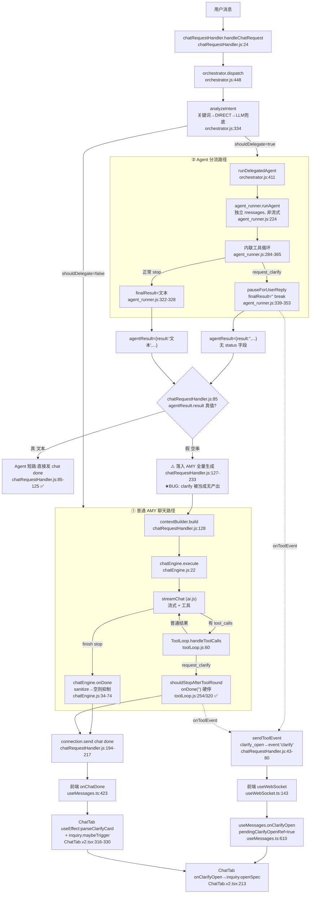

# Chat Protocol Unification Plan

> 架构审计 + 协议收敛方案
> 范围：普通 AMY 聊天 / agent 分流 / tool 调用 / clarify 卡片 / render blocks / legacy `[clarify_card]` 文本协议
> 目标：让“同一用户动作只经过一套状态机、一套事件协议、一套终止规则”
> 评判标准：减少链路分叉，而不是增加 feature
> 证据基准：以源码为准。下文 `代码证据` = 直接读到的源码事实（含 file:line）；`推断` = 基于证据的逻辑推论。

---

## 0. 结论速览（TL;DR）

你报的现象——“`request_clarify` 已调用但没弹自适应问答卡片，反而继续输出普通正文”——**不是模型不稳定，是一个确定性的协议断裂 bug**，再叠加多套并存协议放大了不稳定感。

核心三句话：

1. **唯一的硬 bug**：当一条消息被**路由到专职 Agent**（Coder/Writer/Researcher）且 Agent 调用了 `request_clarify` 时，Agent 会正确发出 `clarify_open` 事件并停下，但它把“暂停等待用户”这个**终止态压成了空字符串 `result: ''`**。`chatRequestHandler.js:85` 用 `agentResult.result` 的**真值性**判断“Agent 是否产出内容”，空字符串为假 → **短路失败 → 回退到 AMY 再跑一整轮普通生成 → 产生残留正文**。卡片事件发了（卡可能闪一下或被正文盖住），正文也来了。
   - 代码证据：`agent_runner.js:336-382`（暂停时 `finalResult=''` 并 `return {result, turnsUsed, tokensUsed}`，无 status）；`chatRequestHandler.js:85`（`if (orchResult.agentResult && orchResult.agentResult.result)`）。

2. **三套终止规则**：AMY 直连 clarify、Agent clarify、legacy 文本 clarify 走**三条不同的终止路径**，只有前者被前端的抑制逻辑覆盖。

3. **两套 clarify 协议同时活着**：结构化 `request_clarify`→`clarify_open`/`waiting_user_reply` 事件协议，与 legacy `[clarify_card]{json}[/clarify_card]` 文本标记协议**并存且被系统提示词互相矛盾地同时教给模型**。

---

## 1. 当前真实链路图

### 1.1 总览（mermaid）



### 1.2 五条路径逐条说明

#### ① 普通 AMY 聊天路径
- **入口**：`chatRequestHandler.js:24` → `orchestrator.dispatch`（`orchestrator.js:448`）判定 `shouldDelegate=false`。
- **状态流转**：`contextBuilder.build`（`chatRequestHandler.js:128`）→ `chatEngine.execute`（`chatEngine.js:22`）→ `streamChat`（`ai.js`，`ai.js:50` 构造 ToolLoop）流式输出 `onDelta`。
- **终止条件**：`streamChat` 收到 `finish_reason:stop` → `chatEngine.onDone`（`chatEngine.js:34`）→ `emitter.onDone`（`chatRequestHandler.js:194`）→ `connection.send` chat done（`chatRequestHandler.js:216`）。
- **前端触发点**：`useMessages.onChatDelta/onChatDone`（`useMessages.ts:388/423`）。
- **代码证据**：以上全部为读到的源码。

#### ② Agent 分流路径
- **入口**：`analyzeIntent` 命中 `INTENT_RULES`（`orchestrator.js:122-151`）或情绪/LLM 兜底，`shouldDelegate=true`（`orchestrator.js:465`）。
- **状态流转**：`runDelegatedAgent`（`orchestrator.js:411`）→ `agent_runner.runAgent`（`agent_runner.js:224`），**Agent 用独立 messages、非流式 `callApi`、自带一套工具循环**（`agent_runner.js:284-365`）。
- **终止条件**：`finish_reason==='stop'` 或无 tool_calls 或超 `maxTurns`（`agent_runner.js:322-364`），返回 `{result, turnsUsed, tokensUsed}`（`agent_runner.js:378-382`）。
- **回主链**：`dispatch` 把 `agentResult` 透传（`orchestrator.js:494-501`）→ `chatRequestHandler.js:85` 决定是否短路。
- **前端触发点**：短路成功时直接收到 `event:'chat'` done（`chatRequestHandler.js:110-121`）+ `agent_status`/`agent-phase`。
- **代码证据**：以上全部为读到的源码。

#### ③ Tool 调用路径（① 的子路径）
- **入口**：`streamChat` 检测到 `tool_calls` → `ToolLoop.handleToolCalls`（`toolLoop.js:60`，被 `ai.js:919/1350/1470` 调用）。
- **状态流转**：执行工具 → `onToolEvent` 推 `tool_call`/`tool_result` → `sendToolEvent`（`chatRequestHandler.js:43`）→ `connection.send event:'tool'` + `agent-phase`。
- **终止条件**：轮次/重复护栏（`toolLoop.js:82-102`）、`waiting_user_reply` 暂停（`toolLoop.js:254`）、`completed+message` 提前完成（`toolLoop.js:259/326`）、否则带着 tool 结果递归 `streamChat`（`toolLoop.js:356-369`）。
- **前端触发点**：`useMessages.onToolEvent`（`useMessages.ts:554`）写入消息 `toolEvents` + 时间线。
- **代码证据**：读到的源码。

#### ④ Clarify 卡片触发路径（结构化 / 权威协议）
- **入口**：模型调用 `request_clarify` 工具。
- **工具行为**：`request_clarify.execute`（`request_clarify.js:141-164`）先 `onToolEvent({type:'clarify_open', payload:{spec}})`，再 `return {status:'waiting_user_reply', message:...}`。
- **两条消费分支**：
  - AMY 链：`ToolLoop` `shouldPauseForUserReply`（`toolLoop.js:11-13,254`）→ `shouldStopAfterToolRound` → `onDone('')`（`toolLoop.js:320-324`）硬停。
  - Agent 链：`agent_runner` 自带的 `shouldPauseForUserReply`（`agent_runner.js:31-33,338-353`）→ `finalResult=''` 并 `break`。
- **事件转译**：`sendToolEvent` 把 `clarify_open` 转成 `event:'clarify'`（`chatRequestHandler.js:56-63`）。
- **前端**：`useWebSocket.ts:143-149` 收 `clarify` → `onClarifyOpen` → `useMessages.ts:610-613`（置 `pendingClarifyOpenRef=true`）→ `ChatTab.v2.tsx:213-218` `inquiry.openSpec(spec)`（`useInlineInquiry.ts:71-76`）。
- **spec 规范化**：后端 `request_clarify.js:65-95` `normalizeSpec`（字段裁到 4、id 蛇形化、label 补问号）。
- **代码证据**：读到的源码。

#### ⑤ Legacy `[clarify_card]` 文本回退路径
- **入口**：模型在**正文里**输出 `[clarify_card]{json}[/clarify_card]`（被 `CLARIFICATION_PROTOCOL.md:183-200` 的“结构 D”教导）。
- **关键差异**：**没有工具调用 → 没有 `waiting_user_reply` → 没有任何硬停**，正文照常流式到 done。
- **前端**：`ChatTab.v2.tsx:316-330` 的 `useEffect` 在消息 finalize 后 `parseClarifyCard`（`parser.ts:21`）剥离标记、并 `inquiry.maybeTrigger`（`useInlineInquiry.ts:56-65`）开卡。
- **spec 规范化**：前端 `parser.ts:85-141` 另一套 `normalizeSpec`（规则与后端**不同**：不裁字段数、id 不强制蛇形、校验更宽松）。
- **回执回流**：用户填完卡 → `formatClarifyReply`（`formatter.ts:7-21`）生成 `[澄清回执] …` 文本 → 作为**新一轮普通消息**重新进 `sendMessage`。
- **代码证据**：读到的源码。

---

## 2. 不一致点审计（同一语义、多套实现）

| # | 语义 | 实现 A | 实现 B（重复/竞态/历史） | 类型 |
|---|------|--------|--------------------------|------|
| I1 | **工具循环** | `runtime/toolLoop.js`（AMY，流式，`ai.js:50`） | `agents/agent_runner.js:284-365`（Agent，非流式，**完全独立**） | 重复实现 |
| I2 | `shouldPauseForUserReply` / `isStructuredToolResult` | `toolLoop.js:7-13` | `agent_runner.js:27-33`（**逐字复制**） | 重复实现 |
| I3 | **clarify 协议** | `request_clarify` 工具 → `clarify_open`/`waiting_user_reply` 事件 | `[clarify_card]` 正文文本标记 | 双协议并存 |
| I4 | **前端开卡入口** | 事件路径 `onClarifyOpen→openSpec`（`ChatTab.v2.tsx:213`） | 文本路径 `parseClarifyCard→maybeTrigger`（`ChatTab.v2.tsx:329`） | 双触发/竞态 |
| I5 | **clarify spec 规范化** | 后端 `request_clarify.js:65` | 前端 `parser.ts:85`（规则不一致） | 重复实现 |
| I6 | **教模型怎么 clarify** | `toolCapabilityPolicy.js:133-156`（“优先工具，**别用** `[clarify_card]`”） | `CLARIFICATION_PROTOCOL.md:183-200`（“用 `[clarify_card]`”） | 提示词自相矛盾 |
| I7 | **残留正文清理** | gateway `chatEngine.js:43-55`（sanitize→空则抑制/兜底） | 前端 `cotExtract.ts:124`（删 `waiting_user_reply`）+ `useMessages.ts:65/438`（空文本才抑制） | 三层防御，互不知情 |

### 2.1 四个关键职责“谁负责”——现状是“多头”

- **谁决定弹卡片**：**两个权威**。(a) 后端 `request_clarify` 工具发 `clarify_open`；(b) 前端对成品消息正文做 `parseClarifyCard`。没有单一裁决者。
- **谁负责停止继续生成**：**三个地方**。(a) `toolLoop.js:254/320`（AMY，有效）；(b) `agent_runner.js:339-353`（Agent 内部 break，但**停止信号在上游丢失**，见 §3）；(c) legacy 文本路径**根本没有停止机制**，靠模型自觉收尾。
- **谁负责把事件送到前端**：事件路径由 `sendToolEvent`（`chatRequestHandler.js:43-80`）统一转译；**但 legacy 文本路径完全不发事件**——卡片来自“解析正文”，绕过事件协议。
- **谁负责清理/抑制残留正文**：`chatEngine.js:43` + `cotExtract.ts:124` + `useMessages.shouldSuppressAssistantTextForClarify`（`useMessages.ts:438-459`）三层。**没有一层覆盖 Agent 回退场景**（因为那一轮 AMY 产出的是非空正文，`shouldSuppress` 判定为 false）。

### 2.2 竞态风险点（代码证据 + 推断）

- **R1（推断）**：前端两条开卡路径都可能为同一轮触发，`useInlineInquiry` 用 `if (active) return false`（`useInlineInquiry.ts:63,72`）让先到者赢。事件先到→开卡；若随后 finalize 的正文里又有 `[clarify_card]` 残片，第二次被丢弃——谁先谁后取决于时序。
- **R2（代码证据→推断）**：`pendingClarifyOpenRef`（`useMessages.ts:206`）在 clarify 事件时置真，但只在 `onChatDone` 消费（`useMessages.ts:438`）。Agent 回退场景里 AMY 产出**非空**正文 → `shouldSuppress=false` → 正文照显示，且该 ref 被重置为 false（`useMessages.ts:443`）→ **抑制标志被“静默吃掉”**。
- **R3（推断）**：Agent 是**无状态独立会话**（`agent_runner.js:258` 每次 `messages=[]`）。Agent 发起 clarify 后，用户 `[澄清回执]` 作为新一轮回到 `orchestrator.dispatch` 重新分类，**原始任务上下文不在任何持久 messages 里**（暂停时 `reply=''`，`chatRequestHandler.js:96-99` 只存了用户原话，没存 Agent 的追问）。→ clarify 跨 Agent 边界会丢上下文。

### 2.3 已经部分统一到什么程度（必须明确）

- **render blocks 已基本单协议**：`renderBlocksNormalizer`（gateway，`chatRequestHandler.js:199-213`）→ `event:'chat'.payload.renderBlocks` → 前端 `extractRenderBlocks`（`useWebSocket.ts:103`）。这条路径是干净的单向协议，**不是问题区**。
- **事件转译层已统一**：所有 tool/canvas/workbench/clarify 出口都过 `sendToolEvent`（`chatRequestHandler.js:43-80`）一个函数。**事件“出口”是单点的**；分叉发生在“谁来触发”和“前端是否还从正文解析”。
- **AMY 直连 clarify 的硬停已收敛且有测试**：`toolLoop.js:320` + `toolAdapter.test.js` 第 23 用例 + `chatRequestHandler.test.js:testClarifyEventForwarding`。**这条是健康的样板**，问题在于 Agent 链没有对齐它。

---

## 3. 根因判断：为什么 GPT/Claude 不会，这个仓库会

**只从架构/协议层回答，不谈“模型稳定性”。**

### 3.1 直接根因
`waiting_user_reply` 是一个**硬终止态**，但它在 Agent 链路里被**编码成了空字符串 `result:''`**（`agent_runner.js:341,378-382`），而 `chatRequestHandler.js:85` 用 `agentResult.result` 的**真值性**来区分“Agent 有没有产出”。空字符串同时意味着：
- “Agent 正常跑完但没话说”，和
- “Agent 暂停等待澄清”

二者**不可区分**。于是“暂停澄清”被误判成“Agent 没产出”，触发 `orchestrator` 的降级直觉——**回退到 AMY 再生成一轮**。这一轮产出真实正文，又恰好绕过了所有为“空文本”设计的前端抑制逻辑（`useMessages.ts:438`）。

一句话：**一个本应贯通到顶层的终止态，在 Agent→Orchestrator→Handler 的边界上被压成了一个无类型的字符串，然后系统用“字符串非空”来重建控制流。**

### 3.2 为什么成熟产品不会出现
| 维度 | GPT/Claude 类产品 | 本仓库 |
|------|------------------|--------|
| 工具循环 | **一套** agentic loop | **两套**（`toolLoop.js` + `agent_runner.js`） |
| “暂停/问用户” | 就是 loop 里**同一套**工具结果，带**显式终止原因**（stop_reason/status）终止**同一个** loop | Agent 把它压成空串，再由另一个引擎（AMY）二次生成 |
| “要结构化输入”的线协议 | **唯一**：tool_call / tool_result | **两套**：结构化事件 + 正文文本标记 |
| 终止判定 | 显式枚举（`end_turn`/`tool_use`/…） | **从字符串空与否推断** |
| 前端 | 只认结构化事件 | 既认事件、又从**正文里正则解析**交互 |

成熟产品的关键不是“模型更强”，而是：**“问用户”不是一个旁路特性，而是主工具循环的一个一等终止态；从 LLM 到 UI 只有一套消息协议，终止态永远是显式的、不靠字符串空值推断。** 本仓库恰恰在“Agent 边界”把显式终止态降级成了隐式字符串，又用第二套引擎兜底，必然产生“调用了却继续输出正文”。

---

## 4. 协议统一方案

总原则（回答你的 6 个硬约束）：

| 约束 | 结论 |
|------|------|
| clarify 只能有一个权威协议 | **是**：唯一权威 = `request_clarify` 工具 → `clarify_open` 事件 + `waiting_user_reply` 状态。`[clarify_card]` 文本协议**降级为纯防御性剥离，不得触发开卡**，最终删除。 |
| agent 和普通聊天是否必须共用同一 tool loop | **理想必须**；**中期至少共用同一“终止态契约”**。短期先打通契约，长期合并 loop。 |
| `waiting_user_reply` 由哪一层定义为硬终止态 | **由“观察到工具结果的那一层（tool loop）”定义，并以结构化字段贯通 agent_runner → orchestrator → chatRequestHandler**。Handler 必须把它当“本轮已终止，禁止回退 AMY”。 |
| 前端是否应彻底停止从正文解析关键交互 | **是**。开卡只允许来自 `clarify` 事件。`parseClarifyCard` 只保留“把残片从显示中抹掉”的清理功能。 |
| legacy `[clarify_card]` 保留/隔离/删除 | **隔离 → 删除**：先从提示词移除、前端隔离为纯清理器；待遥测确认模型不再产出后删除。 |

### 4.1 最小修复版（止血，1～2 处文件，零协议变更）
**只解决 §3.1 的硬 bug，不动 clarify 双协议。**

1. `agent_runner.runAgent` 暂停时返回**带 status 的结构**：`{ status:'waiting_user_reply', result:'', turnsUsed, tokensUsed }`（正常完成时 `status:'completed'`）。
   - 文件：`oct-gateway/agents/agent_runner.js`（`:336-382`）。
2. `orchestrator.dispatch` **透传** `agentResult.status`（已经是整对象透传，无需改，仅确认不丢字段）。
   - 文件：`oct-gateway/orchestrator.js`（`:494-501`，确认透传）。
3. `chatRequestHandler` 把“Agent 已终止”判定从“result 非空”改成“**agentResult 存在即终止**”，并分支：
   - `status==='waiting_user_reply'` → 发 `agent-phase idle` + 一个 `done:true, text:''` 的 chat（让前端 `shouldSuppress` 生效），**RETURN，绝不落入 AMY**。
   - 否则按现有短路逻辑发文本。
   - 文件：`oct-gateway/runtime/chatRequestHandler.js`（`:85`）。
- **消除的风险**：Agent clarify → 残留正文（彻底消除）。
- **验证**：扩 `chatRequestHandler.test.js`，新增 `agentResult={status:'waiting_user_reply', result:''}` 用例，断言 `chatEngine.execute` **未被调用**、且发出 `done.text===''`；`agentRunner.test.js` 增断言 `result.status==='waiting_user_reply'`。

### 4.2 中期收敛版（砍掉协议分叉）
1. **提示词单协议**：从 `CLARIFICATION_PROTOCOL.md`（及 `resources/system_prompts/` 副本、`templates/`）删除“结构 D `[clarify_card]`”，clarify 规则**唯一来源**改为 `toolCapabilityPolicy.js` 注入。对不支持工具的模型：要么降级为 `[pills]`/纯文本追问，要么保留文本路径但**仅在 `toolsSupport!=='supported'` 时**注入（`toolCapabilityPolicy.js:146-156` 已有此分支，保留即可）。
   - 文件：`docs/01_system_prompts/CLARIFICATION_PROTOCOL.md`、`resources/system_prompts/CLARIFICATION_PROTOCOL.md`、`docs/01_system_prompts/templates/*`、`oct-gateway/ai.js:284/367`（确认加载列表）。
2. **前端单触发**：删除 `ChatTab.v2.tsx:329` 的 `inquiry.maybeTrigger` 开卡调用；保留 `parseClarifyCard` 仅做 `stripped` 显示清理（`ChatTab.v2.tsx:323-328`）。开卡只走 `clarify` 事件。
   - 文件：`src/ui/chat/ChatTab.v2.tsx`（`:316-330`）。
3. **spec 规范化单点**：前端信任事件里**后端已规范化**的 spec（`request_clarify.js:65`），`parser.ts:85` 的 `normalizeSpec` 降级为仅 legacy 清理用（或随 legacy 一起删）。
   - 文件：`src/core/clarifyCard/parser.ts`、`src/hooks/useInlineInquiry.ts:56-76`（`maybeTrigger` 可标记 deprecated）。
- **消除的风险**：双协议、双触发、双规范化、提示词矛盾（I3/I4/I5/I6）。

### 4.3 理想最终版（单链路/单状态机）
1. **单工具循环**：`agent_runner` 改为复用 `runtime/toolLoop.js` 的**终止态契约**（甚至直接用同一 ToolLoop，配非流式驱动），删除 `agent_runner.js:27-33` 的重复函数（I1/I2）。
2. **端到端单终止枚举**：定义统一 `TurnOutcome`：
   ```
   { kind: 'final' | 'awaiting_user' | 'delegated_final' | 'error', text, usage, meta }
   ```
   AMY 引擎与 Agent 运行器都返回它；`chatRequestHandler` 用**一个 switch** 消费。`awaiting_user` ≡ `waiting_user_reply` 是**唯一硬停**。
3. **删除 legacy `[clarify_card]`**：遥测确认模型零产出后，删 `parser.ts` 触发分支、`useInlineInquiry.maybeTrigger`、`cotExtract.ts:124` 的 `waiting_user_reply` 兜底删除（届时不再需要）。
- **结果**：同一用户动作 → 一套状态机、一套事件协议、一套终止规则。

---

## 5. 改造计划（按优先级，先方案后代码）

> 每步标注：改哪些文件 / 消除什么风险 / 如何验证。**P0 即最小修复版，建议立刻做；P1/P2 排期。**

### P0-1　Agent 终止态结构化（止血核心）
- **改**：`agent_runner.js`（暂停/完成都带 `status`）、`chatRequestHandler.js:85`（按 status 分支，禁止回退 AMY）。
- **消除**：§3.1 硬 bug——Agent clarify 残留正文。
- **验证**：`chatRequestHandler.test.js` 新增 waiting_user_reply 用例（断言不进 AMY、done.text 为空）；`agentRunner.test.js` 增 status 断言；手动：触发一个会路由到 Writer 且需 clarify 的请求（如“帮我写一篇文案”），确认只弹卡、无正文。

### P0-2　Handler 终止判定语义修正（与 P0-1 同改动块）
- **改**：`chatRequestHandler.js:85` 把 `&& orchResult.agentResult.result` 改为以“agentResult 是否为已完成 Agent 结果对象”为准（存在即终止）。
- **消除**：把“空产出”误当“未派发”的语义混淆。
- **验证**：补一个 `agentResult={status:'completed', result:''}`（Agent 正常但空）用例，确认走 Agent 终止分支而非 AMY（产品语义：Agent 跑过就由 Agent 收尾，给兜底提示而非二次生成）。

### P1-1　提示词收敛为单 clarify 协议
- **改**：`docs/01_system_prompts/CLARIFICATION_PROTOCOL.md`、`resources/system_prompts/CLARIFICATION_PROTOCOL.md`、`templates/*`；确认 `toolCapabilityPolicy.js` 为唯一注入源。
- **消除**：I6 提示词矛盾（模型“工具 or 文本”二选一的随机性）。
- **验证**：跑现有 render/clarify 语料（`docs/test-results/`）；人工检查 supported 模型不再产出 `[clarify_card]`。

### P1-2　前端单触发 + 仅保留清理
- **改**：`ChatTab.v2.tsx:316-330`（去掉 `maybeTrigger` 开卡，保留 `stripped`）。
- **消除**：I4 双触发/R1 竞态、R2 抑制标志被吃。
- **验证**：`useInlineInquiry.test.ts`/`useMessages.test.ts` 增“正文含残片但不开卡、只清理”用例；事件路径开卡用例保持绿。

### P1-3　spec 规范化单点
- **改**：前端信任事件 spec；`parser.ts` 规范化降级 legacy-only。
- **消除**：I5 双规范化导致的字段差异。
- **验证**：对比后端 `normalizeSpec` 与前端渲染，确保字段裁剪/补问号一致。

### P2-1　统一工具循环 / TurnOutcome
- **改**：`agent_runner.js` 复用 `toolLoop.js` 契约；新增 `TurnOutcome` 类型，`chatRequestHandler` 单 switch 消费。
- **消除**：I1/I2 双 loop、根因复发面。
- **验证**：合并后跑全套 `oct-gateway/test/*`；新增“Agent 与 AMY 对同一 clarify 行为一致”对照测试。

### P2-2　Agent clarify 上下文连续性
- **改**：暂停时把 Agent 的追问/任务上下文落到 session 或挂起态，使 `[澄清回执]` 能续回**原 Agent 原任务**（而非重新分类丢上下文）。
- **消除**：R3 跨 Agent 边界丢上下文。
- **验证**：端到端：Writer 发起 clarify → 回执 → 续写命中原指令。

### P2-3　删除 legacy `[clarify_card]`
- **改**：删 `parser.ts` 触发、`useInlineInquiry.maybeTrigger`、`cotExtract.ts:124` 兜底。
- **前置**：P1-1 上线 + 遥测确认零产出。
- **验证**：全量回归 + 灰度。

---

## 6. 风险与回归点

### 6.1 改造后最容易回归的行为
1. **合法的空 Agent 结果被误抑制**：Agent 正常跑完但确实没文本（非 clarify）。→ 必须靠 `status` 区分，不能再看空串。
2. **不支持工具的模型彻底失去 clarify**：若 P1-1 删文本路径时未保留 `toolsSupport!=='supported'` 分支。→ 保留该分支或显式降级 pills。
3. **迁移期“双卡”**：P1-2 未完成时事件 + 文本同时触发。→ P1-1 与 P1-2 必须同批上线。
4. **`[澄清回执]` 续不上**：尤其 Agent 链（R3）。→ P2-2 前，至少保证回执回到 AMY 能基于 session 历史继续。
5. **AMY 直连 clarify 的既有绿色行为被波及**：P2-1 合并 loop 时最容易碰坏 `toolLoop.js:254/320` 这条已验证路径。

### 6.2 必须补的测试清单
- [ ] `chatRequestHandler.test.js`：Agent `waiting_user_reply` → 不进 AMY、done.text 空（**P0 必须**）。
- [ ] `chatRequestHandler.test.js`：Agent `completed + result:''` → 走 Agent 终止兜底，不二次生成。
- [ ] `chatRequestHandler.test.js`：Agent `completed + 文本` → 现有短路（回归保护）。
- [ ] `agentRunner.test.js`：暂停返回 `status:'waiting_user_reply'` + `clarify_open` 已转发（扩现有用例）。
- [ ] `toolAdapter.test.js` #23 保持绿：AMY ToolLoop `waiting_user_reply` 硬停（回归基线）。
- [ ] 前端 `useMessages.test.ts`：clarify 事件 + 后续**空** done → 抑制；clarify 事件 + 后续**非空** done（迁移期）→ 仍正确处理。
- [ ] 前端 `useInlineInquiry.test.ts`：正文含 `[clarify_card]` 残片 → **只清理不开卡**（P1-2 后）。
- [ ] 端到端：Writer/Researcher/Coder 各跑一条“需要 clarify”的请求，断言**只弹卡、无正文**。
- [ ] 提示词回归：supported 模型语料中 `[clarify_card]` 文本产出率 → 0（P1-1 验收门槛）。

---

## 附录 A：核心代码证据索引

| 主题 | 位置 |
|------|------|
| Agent 短路判定（**bug 点**） | `oct-gateway/runtime/chatRequestHandler.js:85` |
| clarify 事件转译 | `oct-gateway/runtime/chatRequestHandler.js:56-63` |
| AMY 落入全量生成 | `oct-gateway/runtime/chatRequestHandler.js:127-233` |
| ToolLoop 暂停/硬停 | `oct-gateway/runtime/toolLoop.js:11-13,254-257,320-324` |
| Agent 内联工具循环 + 暂停压空串 | `oct-gateway/agents/agent_runner.js:284-365,336-382` |
| 重复的 pause 判定函数 | `oct-gateway/agents/agent_runner.js:27-33` ↔ `oct-gateway/runtime/toolLoop.js:7-13` |
| request_clarify 发事件 + 返回 waiting | `oct-gateway/tools/request_clarify.js:141-164` |
| 后端 spec 规范化 | `oct-gateway/tools/request_clarify.js:65-95` |
| orchestrator 分流 + agentResult 透传 | `oct-gateway/orchestrator.js:448-501` |
| clarify 能力规则注入（与提示词矛盾） | `oct-gateway/runtime/toolCapabilityPolicy.js:133-169` |
| 系统提示词教 `[clarify_card]`（结构 D） | `docs/01_system_prompts/CLARIFICATION_PROTOCOL.md:183-200` |
| 系统提示词装载 CLARIFICATION_PROTOCOL | `oct-gateway/ai.js:202,284,367` |
| chatEngine 终止 + 空文本兜底 | `oct-gateway/runtime/chatEngine.js:34-74` |
| 前端 clarify 事件入口 | `src/hooks/useWebSocket.ts:143-149` |
| 前端抑制空 clarify 文本 | `src/hooks/useMessages.ts:65-67,206,438-459,610-613` |
| 前端事件开卡 | `src/ui/chat/ChatTab.v2.tsx:213-218` |
| 前端文本解析开卡（legacy 触发） | `src/ui/chat/ChatTab.v2.tsx:316-330` |
| 前端 clarify 文本解析器 + 另一套规范化 | `src/core/clarifyCard/parser.ts:21-141` |
| 前端 inquiry 状态机双入口 | `src/hooks/useInlineInquiry.ts:56-76` |
| 回执格式 `[澄清回执]` | `src/core/clarifyCard/formatter.ts:7-21` |
| 残留 token 清理 | `src/utils/cotExtract.ts:124` |

---
*本文为审计与方案文档，未改动任何源码。落地请按 §5 优先级分批执行。*
